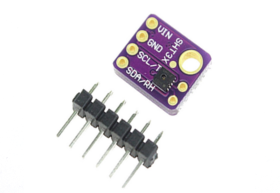

# SHT3X

A MakeCode/PXT extension for the Sensirion's SHT3x digital temperature and humidity sensor.

## Wiring

Pins (GY-SHT3x module <--> Microbit Edge Connector)
- Vcc: 3V pin (3.3V)
- SCL: Pin 19
- SDA: Pin 20
- Gnd: Gnd pin (0V)

## License

MIT

## Supported Targets

* for PXT/microbit

## Acknowledgement

Thank to IoT Engineering Education @ KMUTNB
[https://www.facebook.com/iot.kmutnb/](https://www.facebook.com/iot.kmutnb/)

## Update

2019-Feb-20

